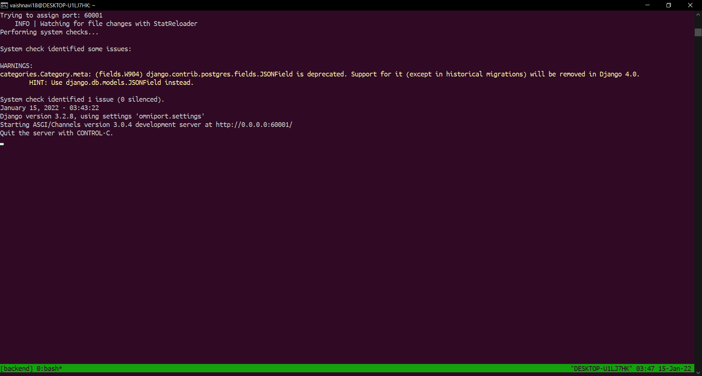

# omniport-setup-cli
To install the cli navigate to the cloned repository and use the command
```
npm install -g .
```
This installs the Omniport-CLI globally. You can use the following commands
```
omniport
```
Gives a brief introduction to Omniport.
<br><br>
```
omniport -h
```
```
omniport --help
```
Gives a help menu on how to use omniport-cli.
<br><br>
```
omniport setup
```
Setup Omniport Docker
<br><br>
```
omniport start
```
Start front-end and back-end servers.

## Working Example
Basic Commands

Interactive Setup

Questions Format

Omniport Start Command

Backend Server

Frontend Server

