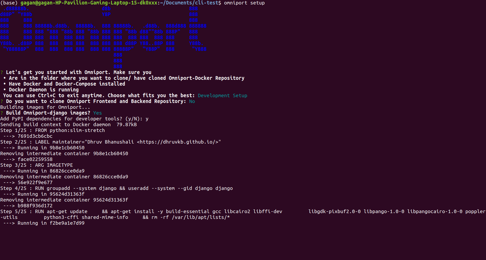
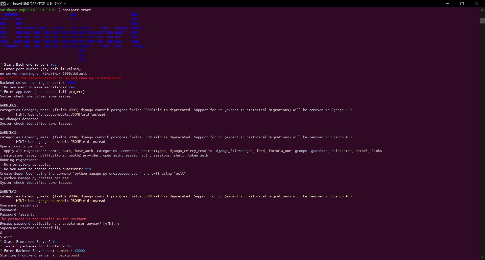

> The CLI of the one true portal for any and every educational institute

## Omniport Setup CLI

This is the CLI built to ease setting up Omniport.

## Technological stack

* Language: `Javascript`<br>
* Runtime Environment: `Node.js`<br>
 A Dockerised setup is the preferred mode of installation. We provide one such on our GitHub account. This CLI aims to do all the work for you to avoid suffering any possible headbanging, cursing, and physical or mental pain.
 
 ## Contribution guidelines

- Fork the repository to your account.
- Branch out to `a_meaningful_branch_name`.
- Send in a `WIP: Pull request`.
- Commit your changes.
- Add your name to `CONTRIBUTORS.md`.
- Get your pull request merged.

It's that simple!

## Setup Instructions

To install the cli navigate to the cloned repository and use the command
```
npm install -g .
```
This installs the Omniport-CLI globally. You can use the following commands
```
omniport
```
Gives a brief introduction to Omniport.
<br><br>
```
omniport -h
```
```
omniport --help
```
Gives a help menu on how to use omniport-cli.
<br><br>
```
omniport setup
```
Setup Omniport Docker
<br><br>
```
omniport start
```
Start front-end and back-end servers.

## Working Example

Basic Commands

Interactive Setup

Questions Format

Omniport Start Command

Backend Server

Frontend Server


## Credits


